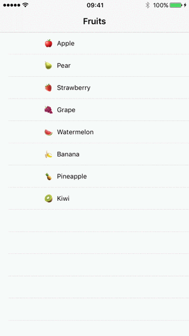
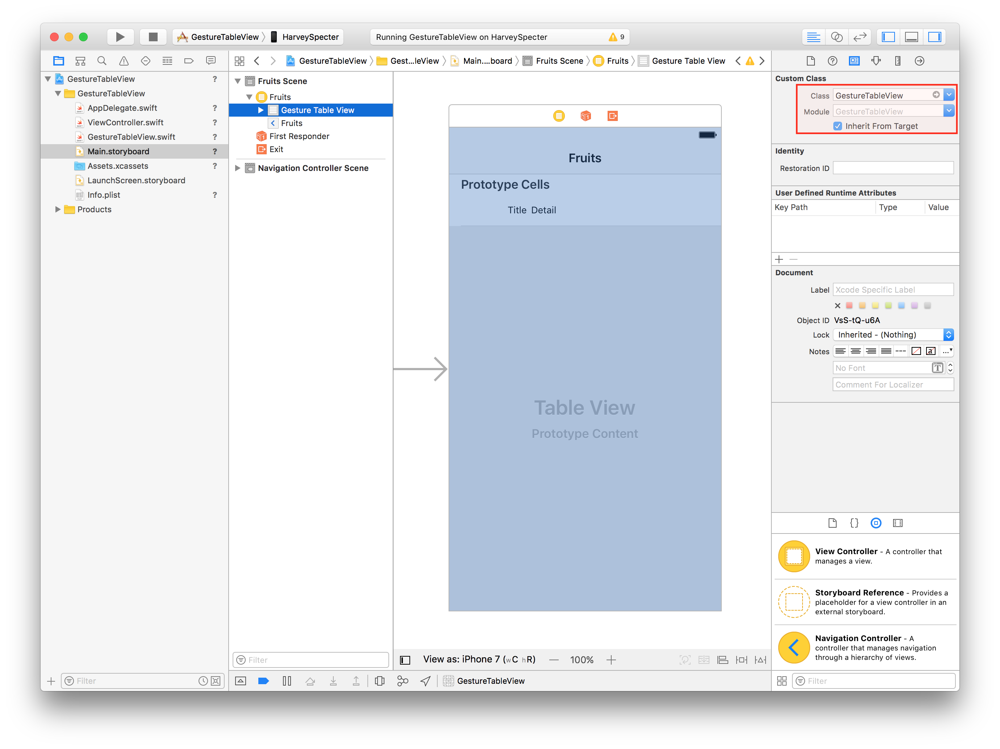

# GestureTableView

👉📱 Long Press Reordering for UITableView

## Quick Start

1. Copy the `GestureTableView.swift` to your project
2. Set it as custom class in the Storyboard

3. Done. Your `UITableView` now supports long press gesture.
